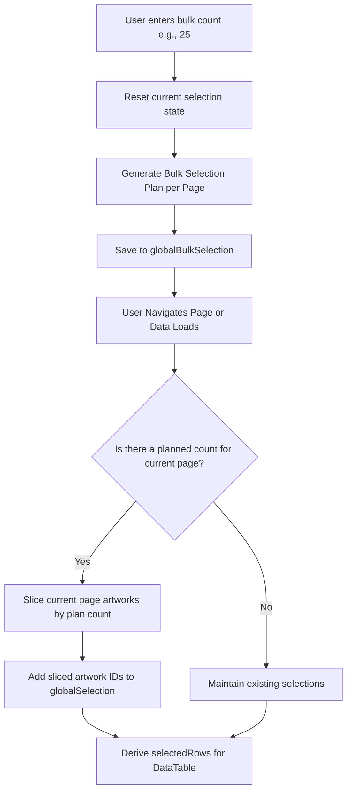

# 🎨 Artworks Dashboard & Smart Selection Tool

A modern, responsive web application for browsing art collections from **The Art Institute of Chicago**. 

While the app looks simple on the surface, it features a custom **"Smart Bulk Selection"** system. This system allows you to select dozens of artworks across different pages with a single click—even before those pages are loaded.

---

## 📖 Table of Contents
1. [🌟 Simple Explanation (For Everyone)](#-simple-explanation-for-everyone)
2. [💡 The Problem & The Smart Solution](#-the-problem--the-smart-solution)
3. [⚙️ How it Works Under the Hood (For Developers)](#%EF%B8%8F-how-it-works-under-the-hood-for-developers)
4. [✨ Features](#-features)
5. [💻 Tech Stack](#-tech-stack)
6. [🚀 Setup & Installation](#-setup--installation)

---

## 🌟 Simple Explanation (For Everyone)

Imagine you are looking at a digital catalog of a museum's artworks. Because there are thousands of paintings, the catalog only shows you **12 paintings at a time** on a page.

*   **The Old Way:** If you wanted to download or print information for **30 paintings**, you would have to select all 12 on the first page, click "Next Page", wait for it to load, select all 12 on the second page, click "Next Page" again, and select the remaining 6 on the third page. This takes time and clicking.
*   **The Smart Way (Our App):** You simply click the little arrow dropdown at the top of the checkbox column, type **30**, and click **Select**. The app will immediately select all 12 on the first page. As you browse to the second and third pages, the app **remembers your goal** and automatically checks the correct number of paintings for you, keeping a live count of your selection.

---

## 💡 The Problem & The Smart Solution

### The Challenge (Why is this hard?)
To make the website load fast, the server only sends 12 items at a time (this is called **lazy-loading**). When you are on Page 1, the browser does not even know what paintings are on Page 2 or Page 3 yet. 

Standard selection checkboxes on websites only work on the items you can see right now. They cannot check boxes for data that hasn't loaded yet.

### Our Solution
We created a **planning system**. Instead of immediately trying to check checkboxes on pages that haven't loaded, our app creates a "plan":
*   *"When Page 1 loads, select 12 items."*
*   *"When Page 2 loads, select 12 items."*
*   *"When Page 3 loads, select 6 items."*

As you navigate, the app automatically executes this plan, selecting the rows the moment they appear on your screen. If you change your mind and uncheck a box, the counter adjusts instantly.

---

## ⚙️ How it Works Under the Hood (For Developers)

<details>
<summary>🛠️ Click to expand Technical Architecture & Code Details</summary>

### State Management Strategy
The selection logic decouples the visual checkmarks from the active dataset by utilizing two separate states:

1.  **`globalSelection`** (`RowSelection[]`): 
    Maps the page index to the array of selected database IDs on that page.
    ```typescript
    type RowSelection = {
      pageNo: number;
      selectedItems: number[];
    };
    ```
2.  **`globalBulkSelection`** (`BulkRowSelection[]`): 
    Stores the pagination-aware plan mapping how many rows *should* be selected on future pages.
    ```typescript
    type BulkRowSelection = {
      pageNo: number;
      count: number;
    };
    ```

### JIT (Just-In-Time) Selection Flow


### Self-Correcting Selection Handlers
*   **Manual Override:** If a user selects more rows than planned, `globalBulkSelection` is reset, switching to manual selection mode.
*   **Deselection Sync:** If a user deselects a row, the plan is updated (`count` is decremented) to keep counts consistent.

</details>

---

## ✨ Features

*   **⚡ Lazy-Loaded Pagination:** Only fetches data as you view it, preserving battery, bandwidth, and speed.
*   **🗳️ Multi-Page Bulk Selection:** Enter any number (e.g. 100) to select that many rows instantly across pages.
*   **📊 Dynamic Selection Counter:** Shows the exact, real-time count of selected items.
*   **🎨 Clean Modern UI:** Sleek tables with striped rows and custom navigation buttons.

---

## 💻 Tech Stack

*   **Frontend:** React 18 (TypeScript)
*   **Styling:** PrimeReact components customized with custom CSS rules ([`src/index.css`](src/index.css))
*   **HTTP Client:** Axios (fetching artwork data)
*   **Build Tool:** Vite

---

## 🚀 Setup & Installation

### Prerequisites
Make sure you have [Node.js](https://nodejs.org/) installed.

### Run Locally
1. Clone the repository and go into the folder:
   ```bash
   cd growMeOrganic
   ```
2. Install all dependencies:
   ```bash
   npm install
   ```
3. Run the app in development mode:
   ```bash
   npm run dev
   ```
4. Open [http://localhost:5173](http://localhost:5173) in your browser.
